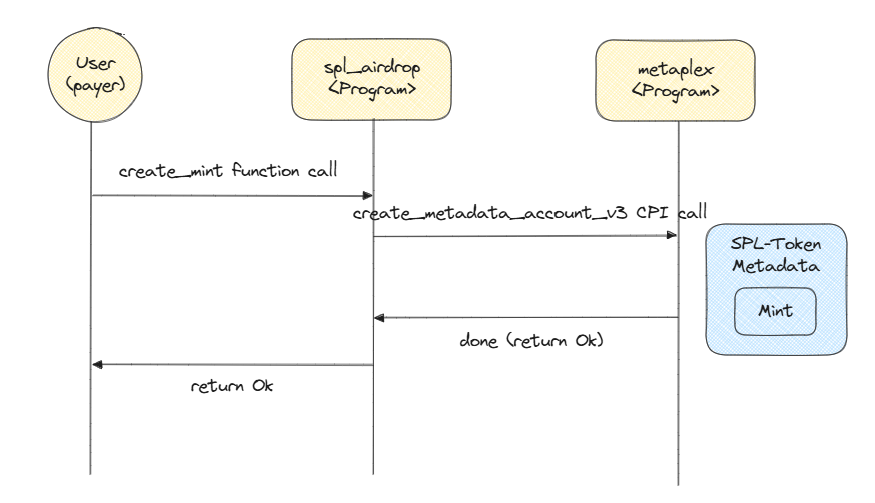
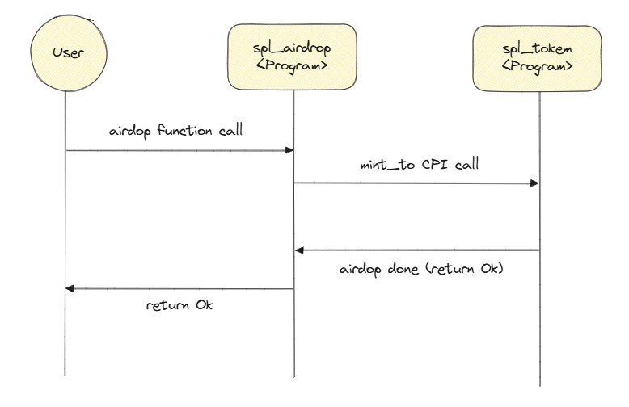

# SPL-Token Airdrop Program
---

이 레포지토리는 SPL(Solana Program Library) Token을 만들고 에어드랍해주는 간단한 예제 프로그램입니다,

# Commands
---

### Build
```bash
anchor build
```

```bash
anchor test
```

프로그램의 로직을 테스트하기 위해서 `anchor test` 명령어를 이용하여 테스트합니다.
그러면 `tests` 폴더에 정의된 타입스크립트 기반의 테스트 코드가 실행됩니다.
이 예제에서는 `create_mint` 함수와 `airdrop` 함수를 집중적으로 테스트합니다.
프로그램(컨트랙트)가 의도대로 동작하는지 확인하기 위해서는 여러 케이스에 대한 테스트를 필수로 진행해야합니다.

**테스트 전 주의해야할 사항**
이 프로그램은 Solana의 Token Metadata Program과 같은 다른 프로그램을 이용합니다.
솔라나 테스트넷이나 메인넷에는 이런 프로그램들이 이미 배포돼있지만, Anchor의 테스트 환경인 로컬넷에는 배포돼있지 않을 수 있습니다.
따라서 `Anchor.toml`에 추가로 정의된 것 처럼 이런 프로그램들을 미리 정의해줍니다.
```toml
[[test.validator.clone]]
address = "metaqbxxUerdq28cj1RbAWkYQm3ybzjb6a8bt518x1s"
```

# Flow
---

### Token Mint 생성

1. create_mint 함수 호출 : 입력 파라미터 `CreateMint`
2. system_program을 통해 mint 계정에 rent-exempt 만큼 할당하고, initialize_mint(CPI, Cross Program Invocation)를 호출합니다. 그러면 Mint 계정을 SPL-Token으로 감싸줍니다.
3. 최종적으로 SPL-Token 표준화된 Mint 계정이 생성됩니다.

### Airdrop 실행
1. airdrop 함수 호출 : 입력 파라미터 `Airdrop`, u64타입의 amount
2. CPI 호출을 위한 계정 준비(`cpi_accounts`) : `MintTo`를 통해 어떤 토큰을 누구에게 할당할지, PDA 서명을 위한 데이터(`b"authority" + authority_bump`)를 준비합니다.
3. CPI를 통해 mint_to 함수를 호출합니다.
4. 정상적으로 실행되면 `recipient_token_account`의 토큰 잔고가 `amount`만큼 증가합니다.

# Sequence Diagram
---

### create_mint()


### airdrop()
